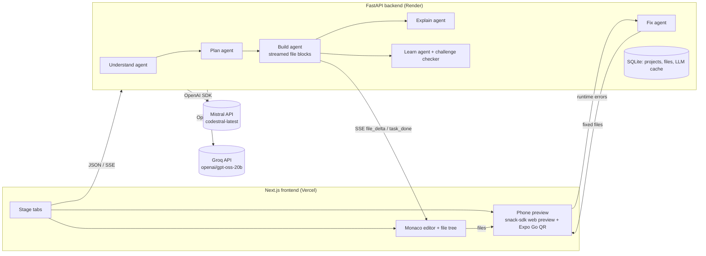

# Lunor Apps

Turn an app idea into a **running React Native (Expo) app in a phone frame**, and learn how it works.
One idea flows through six stages: **Prompt → Understand → Plan → Build → Explain → Learn**.

| Stage | What happens | Model |
|---|---|---|
| Prompt | Type an idea or click an example chip | – |
| Understand | AI restates the idea, lists users and must/nice features, and asks 2–3 clarifying questions with one-click suggested answers | gpt-oss-20b |
| Plan | Editable plan before any code: screens + navigation, data model, numbered tasks. You approve it | Codestral |
| Build | Code streams task by task into a file tree + Monaco editor; the app hot-reloads in an Expo Snack phone preview. Preview errors are sent back to the AI for up to 2 automatic fixes. Ask for changes in plain English afterwards | Codestral |
| Explain | Select lines, a file or a plan task and get a plain-English explanation tied to those lines (highlighted), plus a "why this design" note linked back to the plan | gpt-oss-20b |
| Learn | Concept cards built from *your* code, a 5-question quiz, and "try it yourself" challenges you edit live and the AI checks | gpt-oss-20b (lesson), Codestral (checking) |

Editing the plan after a build marks only the changed tasks for rebuild.

## Architecture



- **The browser only renders.** Every AI call runs in FastAPI (`backend/app/agents/`).
- **Validated JSON between stages.** Understand, Plan, Explain, Learn and Check use **strict `json_schema` structured outputs**. The schema is generated from Pydantic models (`backend/app/schemas.py`); the output is re-validated and re-asked once on failure (`backend/app/llm.py`).
- **Streaming Build.** Structured outputs can't be streamed, so Build/Fix/Change stream a plain-text file-block format (`<<<FILE path>>> … <<<END>>>`). It is parsed incrementally (`backend/app/agents/fileblocks.py`) and pushed to the browser over SSE.
- **Reliable generated apps.** Generated apps use a fixed Expo template and a package allow-list (`backend/app/template.py`). Dependencies are inferred from imports and pinned to the Snack SDK's compatible versions.
- **Error loop.** `snack-sdk` reports runtime and bundling errors from the preview. The frontend sends them to `/fix` (max 2 attempts) only when the last change came from the AI.
- **Config.** All model names live in `backend/app/config.py`, and each can be overridden by env var.

## Run locally

Backend (Python 3.12):

```bash
cd backend
uv venv .venv --python 3.12        # or: python -m venv .venv
uv pip install -r requirements.txt  # or: .venv/Scripts/pip install -r requirements.txt
cp .env.example .env                # then set GROQ_API_KEY and MISTRAL_API_KEY
.venv/Scripts/python -m uvicorn app.main:app --reload --port 8000
```

Frontend (Node 20+):

```bash
cd frontend
npm install
cp .env.example .env.local          # NEXT_PUBLIC_API_URL=http://localhost:8000
npm run dev                         # http://localhost:3000
```

Tests and live smoke check:

```bash
cd backend
.venv/Scripts/python -m pytest -q             # unit tests (no API key needed)
.venv/Scripts/python -m scripts.smoke         # live: Understand -> Plan -> Build 2 tasks (live APIs)
```

## Deploy

- **Backend → FastAPI Cloud.** From `backend/`, run `fastapi deploy`, which logs in through the browser on first use. The entrypoint is `[tool.fastapi] entrypoint = "app.main:app"` in `backend/pyproject.toml`, and dependencies come from `pyproject.toml` / `uv.lock`. `.gitignore` is respected, so `.env`, `.venv` and `*.db` are not uploaded. Set the keys with `fastapi cloud env set GROQ_API_KEY --secret` and `fastapi cloud env set MISTRAL_API_KEY --secret`, then redeploy, because env changes apply on the next deploy.
- **Backend → Render (alternative).** Use `render.yaml` as a blueprint. Set `GROQ_API_KEY` and `MISTRAL_API_KEY`, and set `CORS_ORIGINS` to your Vercel URL. `*.vercel.app` is also allowed by regex.
- **Frontend → Vercel.** Set the root directory to `frontend` and set the env var `NEXT_PUBLIC_API_URL=https://<render-service>.onrender.com`.
- API keys live only in environment variables; `.env` files are git-ignored.

## AI tools used

**In the product**
- Mistral API, called through the **OpenAI Python SDK** (`base_url=https://api.mistral.ai/v1`)
  - **Codestral** (`codestral-latest`): planning, code generation, auto-fix, change requests, challenge checking
- Groq API, called through the **OpenAI Python SDK** (`base_url=https://api.groq.com/openai/v1`)
  - **gpt-oss-120b** (`openai/gpt-oss-120b`): fallback when Codestral is rate-limited
  - **gpt-oss-20b** (`openai/gpt-oss-20b`): Understand, Explain, Learn (lesson + quiz + challenges)
- **Expo Snack** (`snack-sdk`): runs the generated React Native app in the browser and on phones via Expo Go

**While building**
- Claude Code (Anthropic, Claude Opus 5.5): planning, implementation and testing assistance

## Rate limits (important for the demo)

Codestral (Mistral) has a 256K-token context, so Build sends the whole app as context on every task. Groq's free tier limits each model to about 8K tokens per minute, which is fine for the short Understand/Explain/Learn calls. If Codestral is rate-limited, the backend falls back to `openai/gpt-oss-120b` on Groq (`STRONG_FALLBACK_MODEL`).
