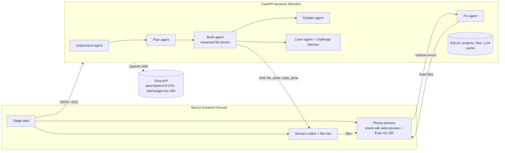

# Lunor Apps

Turn an app idea into a **running React Native (Expo) app in a phone frame**, and learn how it works.
One idea flows through six stages: **Prompt → Understand → Plan → Build → Explain → Learn**.

| Stage | What happens | Model |
|---|---|---|
| Prompt | Type an idea or click an example chip | – |
| Understand | AI restates the idea, lists users and must/nice features, and asks 2–3 clarifying questions with one-click suggested answers | gpt-oss-20b |
| Plan | Editable plan before any code: screens + navigation, data model, numbered tasks. You approve it | Qwen3.8-27B |
| Build | Code streams task by task into a file tree + Monaco editor; the app hot-reloads in an Expo Snack phone preview. Preview errors are sent back to the AI for up to 2 automatic fixes. Ask for changes in plain English afterwards | Qwen3.8-27B |
| Explain | Select lines, a file or a plan task and get a plain-English explanation tied to those lines (highlighted), plus a "why this design" note linked back to the plan | gpt-oss-20b |
| Learn | Concept cards built from *your* code, a 5-question quiz, and "try it yourself" challenges you edit live and the AI checks | gpt-oss-20b (lesson), Qwen3.8-27B (checking) |

Editing the plan after a build marks only the changed tasks for rebuild.

## Architecture



- **The browser only renders.** Every AI call runs in FastAPI (`backend/app/agents/`).
- **Validated JSON between stages.** Understand, Plan, Explain, Learn and Check use Groq **strict `json_schema` structured outputs**. The schema is generated from Pydantic models (`backend/app/schemas.py`); the output is re-validated and re-asked once on failure (`backend/app/llm.py`).
- **Streaming Build.** Groq can't stream structured outputs, so Build/Fix/Change stream a plain-text file-block format (`<<<FILE path>>> … <<<END>>>`). It is parsed incrementally (`backend/app/agents/fileblocks.py`) and pushed to the browser over SSE.
- **Reliable generated apps.** Generated apps use a fixed Expo template and a package allow-list (`backend/app/template.py`). Dependencies are inferred from imports and pinned to the Snack SDK's compatible versions.
- **Error loop.** `snack-sdk` reports runtime and bundling errors from the preview. The frontend sends them to `/fix` (max 2 attempts) only when the last change came from the AI.
- **Config.** All model names live in `backend/app/config.py`, and each can be overridden by env var.

## Run locally

Backend (Python 3.12):

```bash
cd backend
uv venv .venv --python 3.12        # or: python -m venv .venv
uv pip install -r requirements.txt  # or: .venv/Scripts/pip install -r requirements.txt
cp .env.example .env                # then set GROQ_API_KEY
.venv/Scripts/python -m uvicorn app.main:app --reload --port 8000
```

Frontend (Node 20+):

```bash
cd frontend
npm install
cp .env.example .env.local          # NEXT_PUBLIC_API_URL=http://localhost:8000
npm run dev                         # http://localhost:3000
```

Tests and live smoke check:

```bash
cd backend
.venv/Scripts/python -m pytest -q             # unit tests (no API key needed)
.venv/Scripts/python -m scripts.smoke         # live: Understand -> Plan -> Build 2 tasks on Groq
```

## Deploy

- **Backend → Render.** Use `render.yaml` as a blueprint. Set `GROQ_API_KEY`, and set `CORS_ORIGINS` to your Vercel URL. `*.vercel.app` is also allowed by regex.
- **Frontend → Vercel.** Set the root directory to `frontend` and set the env var `NEXT_PUBLIC_API_URL=https://<render-service>.onrender.com`.
- API keys live only in environment variables; `.env` files are git-ignored.

## AI tools used

**In the product**
- Groq API, called through the **OpenAI Python SDK** (`base_url=https://api.groq.com/openai/v1`)
  - **Qwen3.8-27B** (`qwen/qwen3.8-27b`): planning, code generation, auto-fix, change requests, challenge checking
  - **gpt-oss-20b** (`openai/gpt-oss-20b`): Understand, Explain, Learn (lesson + quiz + challenges)
- **Expo Snack** (`snack-sdk`): runs the generated React Native app in the browser and on phones via Expo Go

**While building**
- Claude Code (Anthropic, Claude Opus 5.5): planning, implementation and testing assistance

## Groq rate limits (important for the demo)

On Groq's free (on-demand) tier every model is limited to about **8K tokens per minute**, and `qwen/qwen3.8-27b` also has a **1K output-tokens-per-minute** cap. A full build needs far more than that. When the strong model is rate-limited, the backend automatically falls back to `openai/gpt-oss-120b` (`STRONG_FALLBACK_MODEL`). Each model has its own limit, so the fallback also spreads load. The OpenAI SDK retries 429s with backoff. On the free tier a 6-task build takes about 1–2 minutes. Several judges building at once would queue behind each other, so a paid Developer tier is recommended for the live demo.
